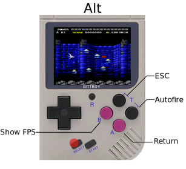
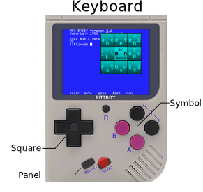

# Welcome to Bittboy MSX

Bittboy MSX is an MSX emulator for the Bittboy console.

[Follow me on Facebook](https://www.facebook.com/patriksretrotech/)

## CONTROLS

There are three modes for the key mapping Normal, Alt and Keyboard.

  

### Change Mapping
		START    Open/close the Keyboard Mapping	
		SELECT   Keep pressed for Alt mapping

### Normal Mapping
		Bittboy    MSX 
		A          Fire A
		B          Fire B
		TA         F5 (Can be redefined in Joystick menu)
		TB         F1 (Can be redefined in Joystick menu)
		Up         Up
		Down       Down
		Left       Left
		Right      Right

### Alt. Mapping
		Bittboy    MSX 
		A          Hotkey show FPS
		B          Return
		TA         Hotkey auto-fire enable/disable
		TB         Escape
		Up         Up
  		Down       Down
  		Left       Left
  		Right      Right

### Keyboard Mapping
		
		Up/Down/Left/Right 	Select one of the 9 squares
		A/B/TA/TB 		Select one of the 4 letters in the highlighted square
		SELECT 			Switch between four different virtual keyboard panels

### Main menu
		R      	Open Main Menu
#### In the Main Menu
		A        Select
		TA/TB    Go Back
		SELECT   Reset the emulator

## COMPILATION

It has been developped under Linux using gcc with BITTBOY Build root.

https://github.com/pthalin/buildroot

Build witha the Makefile in the src archive.
 
All tests have been done using a Bittboy.

## Emulator Authors
		Original fMSX            Marat Fayzullin (1994-2001).
		fMSX-SDL port            Vincent van Dam (2001).
		YM2413/PSG/SCC emulation Mitsutaka Okazaki (2001).
		Y8950 emulation          Tatsuyuki Satoh (1999/2000).
		Dingux port version      Ludovic.Jacomme also known as Zx-81 (zx81.zx81@gmail.com)
		Bittboy version          pthalin (https://github.com/pthalin)
		
## Game included with permission from Authors
		Ailen Attack             Marcos Daniel Blanco
		BlockPuzzle		 David Heremans (https://github.com/turbor)

## About

fMSX emulates MSX, MSX2, and MSX2+ 8bit home computers. It runs MSX/MSX2/MSX2+
software on many different platforms including Windows, MacOS, Unix, MSDOS, 
AmigaOS, etc. See http://fms.komkon.org/fMSX/ for further informations.

Dingux MSX is a port on Dingoo/Dingux of my previous GP2X-Wiz port version.

The Dingux part of this package is under freeBSD license, read LICENSE.txt file 
for more information about it. Original fMSX code is under 
"Marat Fayzullin's license" (see http://fms.komkon.org/fMSX/ for details).

Bittboy-MSX is an adaptation of Dingux-MSX for Bittboy

## INSTALLATION

See INSTALL.txt

